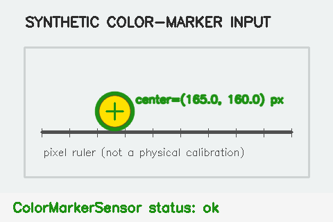
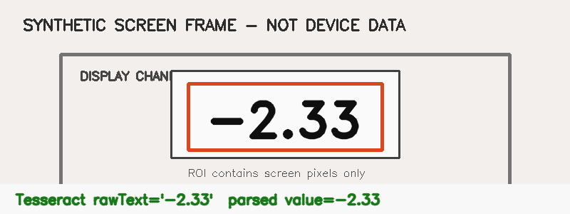
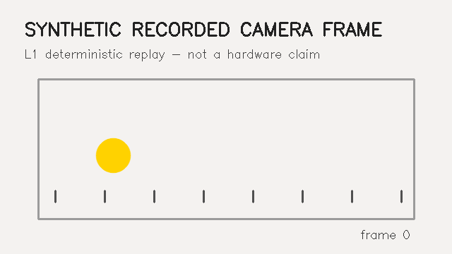
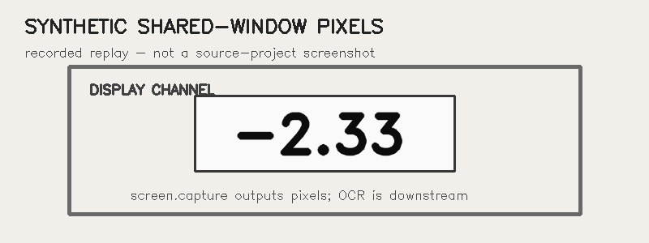
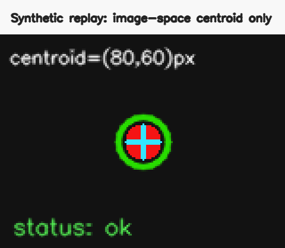
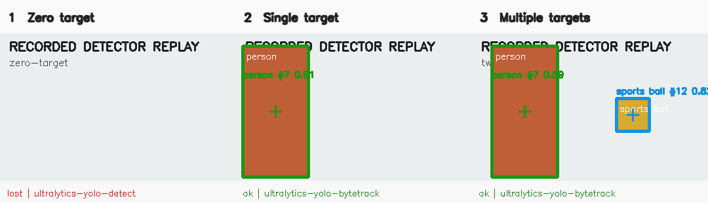

# 物理实验软件传感器库

**Physics Software Sensors** (`physics-software-sensors`) 面向物理实验教学与研究，把摄像头、屏幕和算法产生的观测抽象成可复用、可升级、可测试的“软件传感器”。

本仓库当前进入 **Phase 3D：跨传感器验证与发布准备**。七项传感器已有独立 adapter，并统一记录 E0–E5 证据、组合路径、benchmark、兼容性和真实世界缺口。它们仍全部是 **experimental**；来源仓库仍是历史实现与实际使用场景的事实来源，不要求立即接入。

```text
Camera / Screen → FramePacket → Software Sensor → Measurement / SensorEvent → Physics Experiment
```

## Sensor Catalog

| Sensor | 一句话说明 | 状态 | Docs | Example | Benchmark |
| --- | --- | --- | --- | --- | --- |
| Camera Capture | 产生带时间、后端与丢帧元数据的摄像头帧 | experimental | [Page](sensors/camera.capture/README.md) | [Python](examples/python-camera-capture/README.md) | [replay](sensors/camera.capture/benchmarks/README.md) |
| Screen Capture | 经用户授权采集屏幕/窗口像素帧 | experimental | [Page](sensors/screen.capture/README.md) | [Web/replay](examples/web-screen-capture/README.md) | [replay](sensors/screen.capture/benchmarks/README.md) |
| Number OCR | 从屏幕 ROI 保留 OCR 原文并解析数字 | experimental | [Page](sensors/ocr.number/README.md) | [pixel OCR](examples/web-number-ocr/README.md) | [status](sensors/ocr.number/benchmarks/README.md) |
| Color Marker Tracker | 用 HSV/轮廓连续追踪颜色标记 | experimental | [Page](sensors/tracker.color-marker/README.md) | [Python](examples/python-color-marker/README.md) | [golden](sensors/tracker.color-marker/benchmarks/README.md) |
| Spot Centroid Tracker | 输出图像中红色光斑的亮度加权重心 | experimental | [Page](sensors/tracker.spot-centroid/README.md) | [Python](examples/spot-centroid/README.md) | [golden](sensors/tracker.spot-centroid/benchmarks/README.md) |
| Template / Single-object Tracker | 初始化 ROI 后用 CSRT/KCF/MIL 追踪单个目标 | experimental | [Page](sensors/tracker.template/README.md) | [Python](examples/python-template-tracker/README.md) | [replay](sensors/tracker.template/benchmarks/README.md) |
| YOLO Tracker | 用显式模型 artifact 检测并追踪多个目标 | experimental | [Page](sensors/tracker.yolo/README.md) | [recorded Python](examples/python-yolo-tracker/README.md) | [adapter replay](sensors/tracker.yolo/benchmarks/README.md) |

完整语言/来源对照见 [软件传感器目录](docs/sensor-catalog.md)。页面完整不等于算法已验证；状态以 manifest 和页面成熟度为准。

## Choose a Sensor

| 用途 | 选择 | 成熟度 / 证据 | Docs / Example |
| --- | --- | --- | --- |
| Capture：摄像头或录制序列统一帧 | `camera.capture` | experimental / E1 replay | [Docs](sensors/camera.capture/README.md) / [Example](examples/python-camera-capture/README.md) |
| Capture：用户授权的屏幕/窗口像素 | `screen.capture` | experimental / E1 replay | [Docs](sensors/screen.capture/README.md) / [Example](examples/web-screen-capture/README.md) |
| Read software values：屏幕 ROI 数字 | `ocr.number` | experimental / E3 real OCR, synthetic pixels | [Docs](sensors/ocr.number/README.md) / [Example](examples/web-number-ocr/README.md) |
| Track visible targets：颜色球/标记 | `tracker.color-marker` | experimental / E2 source replay | [Docs](sensors/tracker.color-marker/README.md) / [Example](examples/python-color-marker/README.md) |
| Track visible targets：初始化 ROI 单目标 | `tracker.template` | experimental / E3 real OpenCV, synthetic target | [Docs](sensors/tracker.template/README.md) / [Example](examples/python-template-tracker/README.md) |
| Track visible targets：本地模型多目标 | `tracker.yolo` | experimental / E2; inference pending | [Docs](sensors/tracker.yolo/README.md) / [Example](examples/python-yolo-tracker/README.md) |
| Track optical spots：亮斑重心 | `tracker.spot-centroid` | experimental / E2 source replay | [Docs](sensors/tracker.spot-centroid/README.md) / [Example](examples/spot-centroid/README.md) |

像素位置、OCR 读数和检测置信度都不是自动得到的物理量或计量不确定度。选择后请同时查看 [证据等级](docs/evidence-levels.md)、[验证矩阵](docs/validation-matrix.md) 和对应限制。

## Working demonstrations

| Color Marker Tracker | Number OCR |
| --- | --- |
| [](sensors/tracker.color-marker/README.md) | [](sensors/ocr.number/README.md) |
| BGR frame → HSV/contour → position/lost SensorEvent | RGBA screen frame → ROI/preprocess → Tesseract.js → numeric SensorEvent |

两张图均由本仓库 standalone example 实际运行生成，输入明确为 synthetic，不是来源项目截图、真实设备数据或实验精度证据。

| Camera source | Screen source |
| --- | --- |
| [](sensors/camera.capture/README.md) | [](sensors/screen.capture/README.md) |
| Image sequence/OpenCV backend → RuntimeFrame | user-authorized browser/recorded backend → RuntimeFramePacket |

两项 capture demo 是 deterministic replay 证据；真实相机与浏览器人工 smoke/兼容矩阵尚未完成。

| Spot centroid | Template / single-object tracker |
| --- | --- |
| [](sensors/tracker.spot-centroid/README.md) | [](sensors/tracker.template/README.md) |
| Camera FramePacket → red weighted centroid pixel / lost | initialization ROI + Camera FramePacket → bbox / backend / lost |

两图都由本仓库 adapter 实际运行产生，输入明确为 synthetic。Spot 输出不是机械位移或振幅；Template profile 是 ROI-initialized OpenCV tracker，不是静态 template matching。

| YOLO detector/tracker replay |
| --- |
| [](sensors/tracker.yolo/README.md) |
| Camera FramePacket → recorded detections/track IDs/fallback → multi-target SensorEvent |

YOLO 图来自固定来源执行输出的 recorded replay，不是真实模型推理。Phase 3C 没有提交/下载权重，也没有声称模型 accuracy 或真实 ByteTrack 性能。

## 核心原则

1. **不破坏来源项目**：采用适配器式渐进迁移，不直接搬走或重写原仓库功能。
2. **原始观测优先**：保存原始算法输出、时间信息和质量标志；平滑值、物理换算值必须可区分。
3. **不伪造能力**：mock、占位实现、真实实现、经基准验证实现必须明确标注。
4. **时间和坐标显式化**：墙钟、单调时钟、源时间戳、像素坐标、归一化坐标和物理坐标不得混用。
5. **升级可追溯**：实现来源必须锚定仓库、完整 commit SHA、文件和验证记录。

## 快速导航

- [总体架构](docs/architecture.md)
- [软件传感器目录](docs/sensor-catalog.md)
- [来源图片与演示资产盘点](docs/asset-inventory.md)
- [许可证与来源边界](docs/licensing-and-provenance.md)
- [统一传感器接口](docs/sensor-interface.md)
- [统一数据格式](docs/data-format.md)
- [基准测试方案](docs/benchmarking.md)
- [七传感器 benchmark 汇总](docs/benchmark-summary.md)
- [兼容性矩阵](docs/compatibility-matrix.md)
- [真实世界验证缺口](docs/real-world-validation-gaps.md)
- [成熟度门禁](docs/maturity-gates.md)
- [依赖与许可证审计](docs/package-dependency-audit.md)
- [Release / sensor bundle dry run](docs/release-readiness.md)
- [版本与升级流程](docs/versioning-and-upgrades.md)
- [第一阶段路线图](docs/roadmap.md)
- [机器可读契约](contracts/README.md)
- [贡献指南](CONTRIBUTING.md)

## 目录结构

```text
physics-software-sensors/
├── contracts/                  # JSON Schema 与有效示例
│   ├── examples/
│   └── schemas/
├── sensors/                    # Sensor Page、来源、清单、资产、示例与 benchmark
├── packages/
│   ├── python/                 # physics-software-sensors / physics_sensors
│   └── typescript/             # @physics-software-sensors/core
├── examples/                   # 脱离原实验项目的最小示例
├── benchmarks/                 # 数据集、协议与结果的边界
├── docs/                       # 架构、接口、数据、盘点与路线图
├── templates/                  # 升级、基准和数据集记录模板
├── tests/                      # 契约与仓库一致性测试
└── tools/                      # 本地校验工具
```

## 本地校验

安装实验性 Python camera、颜色追踪与测试依赖：

```bash
python3.12 -m venv .venv
source .venv/bin/activate
python -m pip install -e 'packages/python[color-marker,camera-opencv,classical-trackers,dev]'
```

运行仓库校验、Python 测试和完整 TypeScript OCR 测试：

```bash
python tools/validate_repo.py
pytest
npm --prefix packages/typescript install
npm --prefix packages/typescript test
```

最小 CI 模板位于 [`templates/github-actions-ci.yml`](templates/github-actions-ci.yml)，使用 `npm --prefix packages/typescript run test:offline` 避免下载 Tesseract 语言数据。当前 OAuth 缺少 `workflow` scope，因此模板尚未安装到 `.github/workflows/`；真实 Tesseract integration 由可审计的本地完整测试单独报告。

## 当前非目标

- 不整体搬运现有实验应用、UI 或业务 store；
- 不承诺硬实时、硬件同步或计量精度；
- 不提交摄像头原始视频、屏幕录制、个人图像、模型权重或未脱敏数据；
- 不把屏幕 OCR 表述成对实验设备 SDK 或内部数据的直接读取；
- 不把 `0.5.0` 实验性 source/adapter 描述为稳定、计量验证、真实设备兼容或模型准确率证据。

### Agent development handoff

Latest development handoff:

- [.agent-handoff/latest.md](.agent-handoff/latest.md)
- [.agent-handoff/latest.json](.agent-handoff/latest.json)

## 许可

代码与文档采用 [MIT License](LICENSE)。来源项目的代码、模型、数据与第三方依赖仍受各自许可证约束；未来迁移前必须单独完成许可证核查。
