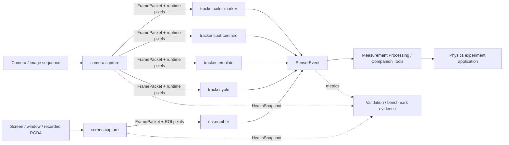

# 总体架构

## 1. 定位

软件传感器是“产生带语义、时间、质量和来源信息的观测事件”的独立组件。它可以是采集源，也可以是处理已有帧的分析器，但不负责实验 UI、业务状态管理、绘图或论文结论。



这五条组合路径由 [`tests/composition/matrix.json`](../tests/composition/matrix.json) 明确声明并测试。没有物理意义的交叉组合不为了“覆盖率”而构造。

## 2. 分层

| 层 | 职责 | 不应包含 |
| --- | --- | --- |
| `contracts` | 跨语言 Schema、字段语义、兼容规则 | 算法实现 |
| `sensors` | 能力清单、来源锚点、成熟度 | 大文件、模型权重 |
| `packages/*` | 各语言接口和未来适配器 | 实验专用页面 |
| `benchmarks` | 数据集卡、协议、结果与验收门槛 | 未脱敏原始数据 |
| `processing` | 处理已有观测/测量的数学、标定、派生和 renderer-neutral 工具 | 新的直接观测、实验 UI |
| 下游应用 | UI、实验流程、可视化、导出 | 私自改变事件语义 |

## 3. 两类统一组件

### SourceSensor

主动产生 `FramePacket` 或直接产生测量事件，例如摄像头与屏幕采集。它负责权限、设备状态、时间戳和丢帧统计，不负责识别物理量。

### ProcessorSensor

消费 `FramePacket`，产生 `SensorEvent`，例如 OCR、颜色追踪、YOLO、模板追踪和光斑重心。它必须说明需要的颜色空间、ROI、模型/模板版本和坐标系。

两类组件共享相同生命周期和健康状态，差别只体现在输入输出声明中。

### Companion Processing Tool

处理已有 SensorEvent 或标量 measurement，不实现 Sensor 生命周期，也不产生新的直接观测。首个工具 `vector.compose-3d` 保留分量来源/质量/时间，数学 core 与坐标渲染映射分离。工具使用独立 `tool.json` 和 Tool Catalog，不能计入 Sensor 数量。

## 4. 数据流约束

1. 帧与事件通过 `run_id`、`event_id`、`parent_event_ids` 形成可追溯链。
2. 原始二进制数据使用 `uri` 和 `sha256` 引用，默认不嵌入 JSON。
3. 采集时间与处理完成时间分别记录；延迟不得伪装成采样时间。
4. 所有二维位置必须带 `coordinate_frame`。`pixel` 不等于 `normalized`，更不等于 `physical`。
5. 追踪丢失产生显式 `lost` 事件，不沿用上一次位置冒充当前测量。
6. 传感器可以输出多个 measurement，但每个值必须有名称、类型和单位。

## 5. 渐进迁移策略

每项能力采用相同路径：

```text
来源盘点 → 契约测试 → 薄适配器 → 回放对照 → 硬件验证 → 下游试点 → 稳定发布
```

- 第一阶段：契约、Schema、文档和类型骨架；
- 第二阶段：Python Color Marker 与 TypeScript Number OCR 两个可安装、可演示试点；
- 第三阶段：先实现 camera/screen FramePacket 来源层，再迁移其余 processor；
- 第四阶段：下游仓库按版本依赖接入，保留原路径作为回退；
- 第五阶段：只有完成对照和回退演练后，才考虑删除下游重复实现。

## 6. 关键架构决定

- **JSON Schema 是跨语言事实来源**：Python 和 TypeScript 类型应由其约束，而非互相复制后各自演化。
- **事件信封稳定、payload 可扩展**：通用字段使用语义化版本控制；算法特有调试值放在 `payload`。
- **适配器不改算法**：首次迁移只对齐接口和输出，算法优化另开升级记录。
- **离线可复现优先**：基准必须支持录制回放；真实硬件测试作为额外层次，不替代离线回归。
- **证据与成熟度分离**：E0–E5 描述实际运行层次；experimental/validated/stable 由独立门禁决定。

## 7. 软件包与单独查看

```text
physics_sensors.core
        ↑
physics_sensors.capture.camera
        ↑
physics_sensors.tracking.color_marker

@physics-software-sensors/core
        ↑
capture/screen → ocr/number + RecordedNumberRecognizer / TesseractJsRecognizer
```

公共 core 不依赖实验 UI。序列化 FramePacket 只保存 artifact 引用；进程内 adapter 通过 `RuntimeFrame` / `RuntimeFramePacket.pixels` 绑定实际 pixels，避免把大二进制塞入 JSON。Sensor Page 允许单独理解一个传感器，但实现可以显式依赖公共 core；“单独查看”不等于鼓励复制单文件。

计划支持三种分发方式：

1. stable 阶段通过 `pip install physics-software-sensors` 或 npm 安装；
2. 稳定版本生成带校验值与变更记录的 GitHub Release；
3. 任何阶段都可直接进入 `sensors/<sensor-id>/` 阅读用途、来源、限制、示例与 benchmark。
