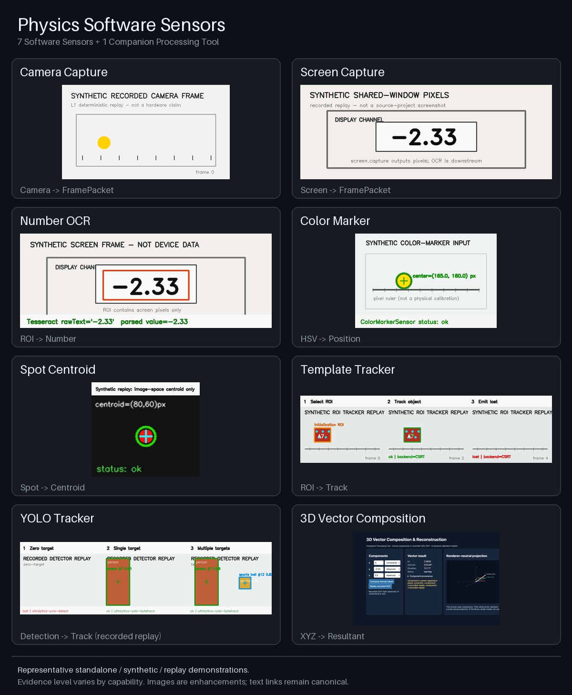

# Capability Showcase

[English](capability-showcase.md) | [简体中文](capability-showcase.zh-CN.md) | **日本語**

<!-- section:overview -->
## 概要

repository のホームページでは、GitHub Raw/CDN への個別リクエストを減らすため、集約したプレビュー画像を 1 枚だけ読み込みます。この詳細ページを開いた場合は、8 項目それぞれのデモを確認できます。

集約画像は `python3 tools/build_capability_showcase.py` により、下記 8 枚から再現可能な形で生成されます。ネットワークや外部画像ホストは使用しません。

<!-- section:software-sensors -->
## Software Sensor

### Camera Capture

recorded または live のカメラ画像を、時刻情報付き `FramePacket` にします。画像は決定的な synthetic camera replay であり、実カメラの検証結果ではありません。

### Screen Capture

ユーザーが許可した画面または window の pixel を `FramePacket` にします。画像は synthetic shared-window pixel です。

### Number OCR

画面画像の ROI にある文字を認識し、数値観測へ parse します。device SDK の値を直接取得するものではありません。

### Color Marker Tracker

HSV カラーマーカーを検出して画像座標上の中心を報告します。pixel 位置は校正済みの物理変位ではありません。

### 光スポット重心

画像 ROI 内にある光スポットの輝度加重重心を報告します。機械変位を直接測定する Sensor ではありません。

### Template / Single-object Tracker

OpenCV の単一物体 backend で初期 ROI を追跡し、bbox/lost 状態を出力します。静的な template matching ではありません。

### YOLO Tracker

**recorded detector replay** によって detection と track ID を示します。この公開画像は実 YOLO model inference のエビデンスではありません。

<!-- section:companion-tools -->
## Companion Processing Tools

### 3次元ベクトル合成

追跡可能な x/y/z スカラー成分を、合成ベクトルと renderer-neutral な model に構成します。既存の観測から導出する Tool であり、新しい Sensor の直接観測ではありません。[standalone Web example](../examples/web-vector-compose-3d/README.md)も参照してください。

<!-- section:evidence -->
## エビデンス境界

これらは standalone、synthetic、recorded、replay の代表的なデモです。エビデンスレベルは capability ごとに異なり、画像だけで実機精度、校正、再現性、計量性能を証明することはできません。canonical demo asset は引き続き本 repository で version control されます。
