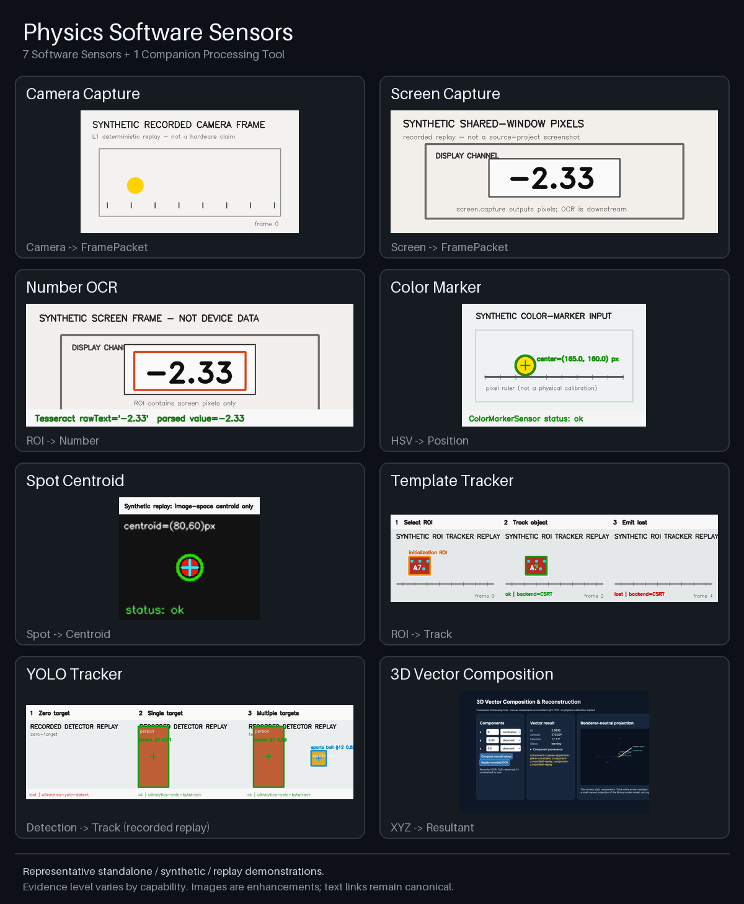
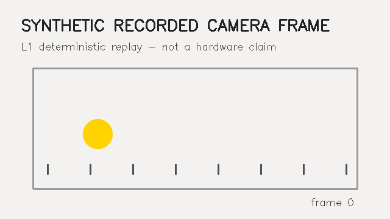
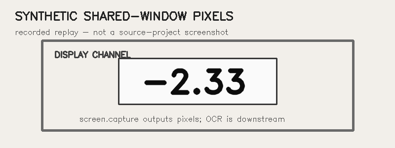
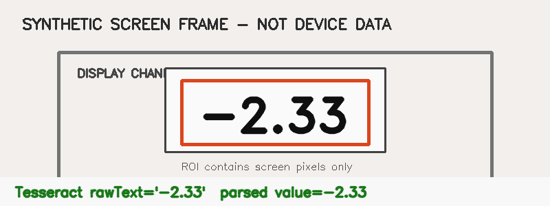
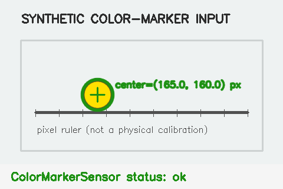
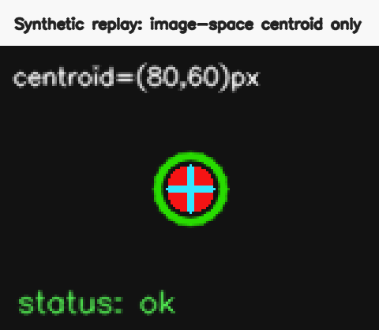
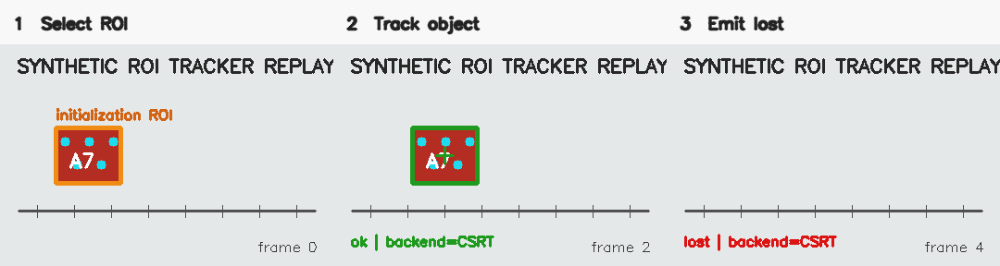
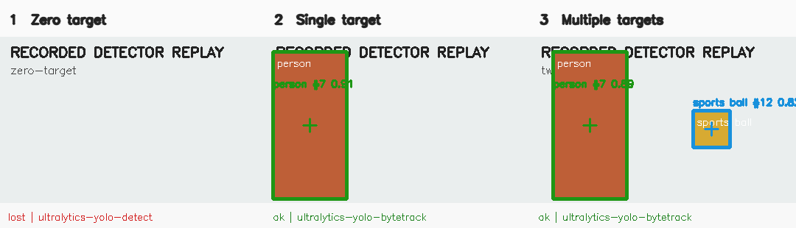
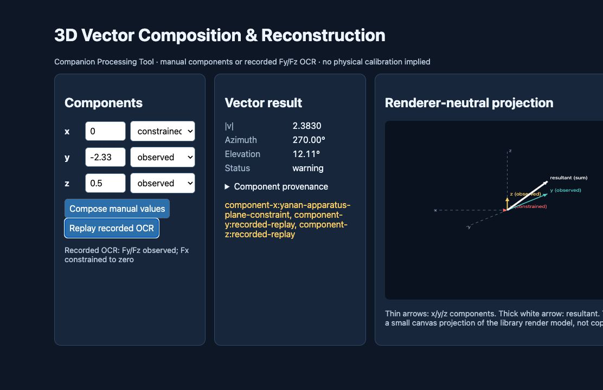
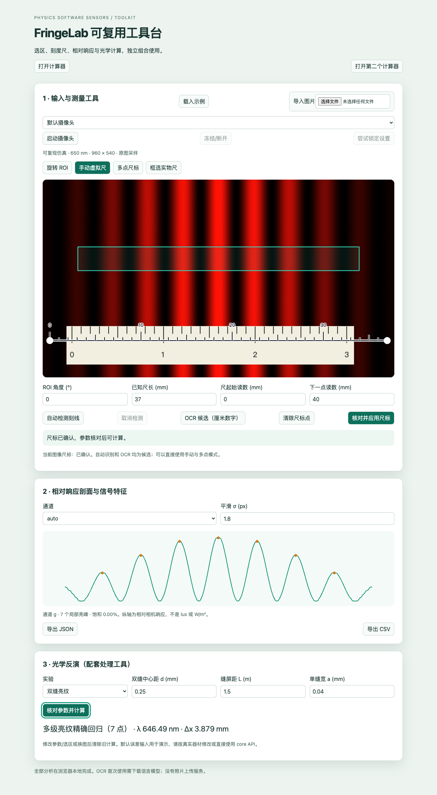

# 能力展示详情

[English](capability-showcase.md) | **简体中文** | [日本語](capability-showcase.ja.md)

<!-- section:overview -->
## 概览

当前展示覆盖 9 个 Sensor 和 4 个处理工具。原有八项演示保留聚合预览，新增 FringeLab 运行截图和组件说明表，可直接找到两批工具的复用入口。

聚合图由 `python3 tools/build_capability_showcase.py` 从下面八张图片可重复生成；脚本不访问网络，也不使用外部图床。

<!-- section:software-sensors -->
## 软件传感器

### 摄像头采集

把录制或实时摄像头图像组织为带时间信息的 `FramePacket`。图片是确定性的合成摄像头回放，不代表真实硬件测试。

### 屏幕采集

把用户授权的屏幕或窗口像素组织为 `FramePacket`。图片使用合成的共享窗口像素。

### 数字 OCR

识别屏幕图像 ROI 中的文本并解析数字观测；它读取的是屏幕像素，不是设备 SDK 数值。

### 颜色标记追踪

寻找 HSV 颜色标记并报告图像坐标中心。像素位置不等于经过标定的物理位移。

### 光斑重心

报告图像 ROI 中光斑的亮度加权重心，并不直接测量机械位移。

### 模板 / 单目标追踪

使用 OpenCV 单目标 backend 追踪初始化 ROI，输出 bbox/lost 状态；它不是静态模板匹配。

### YOLO 追踪

通过 **recorded detector replay** 展示检测结果与 track ID。这张公开图片不是真实 YOLO 模型推理证据。

<!-- section:companion-tools -->
## 配套处理工具

### 三维矢量合成

把可追溯的 x/y/z 标量分量合成为合矢量及与渲染器无关的模型。它派生已有观测，不会冒充新的 Sensor 直接观测。参阅[独立 Web 示例](../examples/web-vector-compose-3d/README.md)。

### FringeLab 光强分布与光学测量组件套件

从光强分布实验中拆解的可复用组件，收录在 `@physics-software-sensors/fringelab` 0.1.0；可以组合使用，也可以单独引入以后其他项目。两批均已收录。

**第一批：**计算器、ROI、虚拟尺、人工标定、剖面分析。

**第二批：**自动尺、尺标 OCR、浏览器相机、光学反演。

| 组件 | 可以复用的功能 | 使用入口 |
| --- | --- | --- |
| 浮窗计算器 | 拖动浮窗、多实例、四则/括号/乘方和科学计数 | [`UI`](../packages/fringelab/README.md) |
| ROI 与虚拟尺 | 原图坐标下移动、旋转、缩放选区；尺端点、刻度和吸附 | [`UI`](../packages/fringelab/README.md) |
| 人工标定 | 已知长度两点标定、可编辑多点读数和分段映射 | [`calibration.scale-1d`](../processing/calibration.scale-1d/README.zh-CN.md) |
| 剖面与信号分析 | 相对光强剖面、通道质量、平滑、峰谷和峰宽 | [`image.strip-profile`](../sensors/image.strip-profile/README.zh-CN.md) |
| 自动尺 | 实体刻线候选；保留人工/框选、对比色和吸附选项 | [`vision.ruler-ticks`](../sensors/vision.ruler-ticks/README.zh-CN.md) |
| 尺标 OCR 与相机 | 厘米数字候选；浏览器采集/冻结画面、检查相机设置 | [`browser`](../packages/fringelab/README.md) |
| 光学反演 | 干涉/衍射波长、回归、不确定度和模拟 | [`optics.fringe-wavelength`](../processing/optics.fringe-wavelength/README.zh-CN.md) |

[中文使用指南](fringelab-toolkit.zh-CN.md) · [API 与安装](../packages/fringelab/README.md) · [可运行示例](../examples/web-fringelab-toolkit/README.md) · [剖面特征工具](../processing/signal.profile-features/README.zh-CN.md) · [FringeLab guide](fringelab-toolkit.zh-CN.md)

自动识别与 OCR 结果经人工核对后应用，人工和多点模式完整保留。截图来自可运行的 650 nm 合成示例；DN 表示相对响应，尚未认证实机测量精度。

当前目录覆盖：**9/9 个 Sensor + 4/4 个处理工具 = 13/13 项能力**。计算器和叠加 UI 是额外可复用组件，不计入 Sensor 数量。

### 实验性热学模型与 Core 支持

[GasLab 0.1.0](../packages/gaslab/README.zh-CN.md) 提供无界面气体教学模型；未发布 Core 0.3.1 增加物理量候选解析、拟合/外推、读数稳定与可选 OCR 预处理。[审查及证据](gaslab-intake.zh-CN.md) · [无界面回放示例](../examples/headless-gaslab/README.md)。模型和支持包与上述 **13 项 Sensor/Companion Tool 能力**分开，不意味着新增直接观测、npm 发布或 v0.6.0 下载。

<!-- section:evidence -->
## 证据边界

这些是代表性的 standalone、synthetic、recorded 或 replay 演示。不同能力的证据等级不同；任何单张图片都不能单独证明真实设备精度、标定、重复性或计量性能。规范 demo 资产继续保存在本仓库并纳入版本控制。
