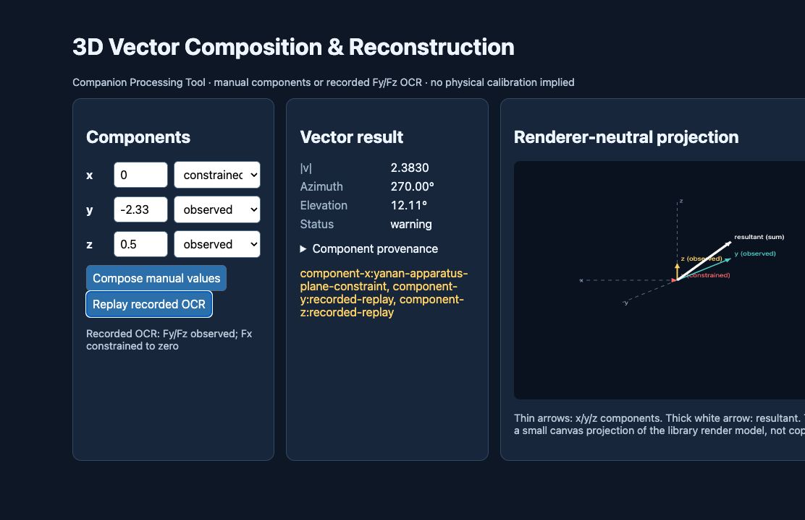

# 三维矢量合成与重建

[English](README.md) | **简体中文** | [日本語](README.ja.md)

<!-- section:name -->
## 名称

`vector.compose-3d` · 三维矢量合成与重建 · 版本 `0.1.0` · `experimental`

它是 **Companion Processing Tool（配套处理工具）**，不是 Sensor。

<!-- section:purpose -->
## 用途

把三个标量分量合成为可追溯的三维矢量，输出模长、归一化方向、方位角和仰角。它可位于 OCR 或其他标量测量之后，用于力、磁场、加速度、速度等实验。

<!-- section:boundary -->
## 观测边界

本工具不产生新的直接观测。`screen.capture` 观测屏幕像素，`ocr.number` 从像素中派生标量读数，本工具再处理已有读数。受约束分量绝不会被描述成传感器观测值。

<!-- section:source -->
## 来源行为

延安安培力项目历史版本把 F1/F2/F3 作为 x/y/z 三个正交标量分量；当前 main 通过 OCR 观测 Fy/Fz，并明确把 Fx 约束为零。[Git 历史研究](../../docs/research/yanan-vector-reconstruction-history.md)严格区分两种行为。

<!-- section:input -->
## 输入

每个 x/y/z 分量在可用时携带有限数值、`observed | derived | constrained | default | missing` 来源、可选毫秒时间戳，以及自己的置信度、不确定度、warning 和 error。物理量、单位、坐标系名称都由调用者作为 metadata 提供，因此数学核心不写死为“力”。

<!-- section:output -->
## 输出

`Vector3Measurement` 包含分量、模长、归一化矢量、方向、最新分量时间戳、分量时差、状态和未合并的逐分量质量。方位角采用度，范围 `[0, 360)`，在 x-y 平面从 +x 朝 +y；仰角采用度，范围 `[-90, 90]`，从 x-y 平面朝 +z。零矢量的 `normalized` 和 `direction` 都是 `null`。

<!-- section:example -->
## 最小示例

```ts
import { Vector3Assembler } from '@physics-software-sensors/core';

const result = new Vector3Assembler({ maxComponentSkewMs: 150 }).compose({
  quantity: 'force',
  unit: 'N',
  coordinateSystem: 'classroom-x-y-z',
  components: {
    x: { value: 0, source: 'constrained' },
    y: { value: 1.2, source: 'observed', timestampMs: 1000 },
    z: { value: -0.8, source: 'observed', timestampMs: 1040 },
  },
});
```

OCR 失败应转换为 `{ source: 'missing' }`；结果保持 `incomplete`，不会虚构矢量。

<!-- section:quality -->
## 时间与质量

若时间戳跨度超过 `maxComponentSkewMs`，结果保留并标记 `component-time-skew` 和 warning 状态。各分量置信度分别保存；本工具不会取平均后称为“矢量准确率”。

<!-- section:coordinates -->
## 坐标与可选渲染适配

数学核心使用调用者声明的 x/y/z 坐标系。`CoordinateTransform3` 是独立矩阵适配器。延安专用可选映射为课堂 `(x,y,z)` → Three.js 场景 `(-x,z,y)`。`createVector3RenderModel` 只输出坐标轴、分量箭头和合矢量箭头数据，不接管 Three.js 或应用 UI。

<!-- section:demo -->
## Demo 与测试

可运行[小型浏览器 demo](../../examples/web-vector-compose-3d/README.md)，支持手动输入和 recorded OCR 模式。来源 golden、数学、分量来源、时差、坐标和 OCR 组合覆盖见 [benchmark](benchmarks/README.md)。

[](../../examples/web-vector-compose-3d/README.md)

图片来自 standalone demo 的真实运行截图；证据记录见 [assets/README.md](assets/README.md)。

<!-- section:status -->
## 状态与分发

当前为 `experimental`、版本 `0.1.0`，只存在于尚未发布的 TypeScript 源码中。它不属于不可变的 `v0.6.0` Release，尚未发布 `v0.7.0`，仓库仍然只有 7 个 Sensor。

<!-- section:limitations -->
## 已知限制

- 尚未反向接入延安项目实时流程。
- 不推断物理标定或计量不确定度。
- 不依赖 Three.js，也未提供完整 3D scene renderer；适配器只输出与渲染器无关的箭头数据。
- 调用者提供的时间戳必须属于同一时钟域。
- 尚未完成跨浏览器、跨操作系统性能 benchmark。

<!-- section:provenance -->
## 来源追溯

commit/file/symbol 锚点和 clean rewrite 许可证决定见 [SOURCE.md](SOURCE.md)。没有复制来源仓库代码或素材。
