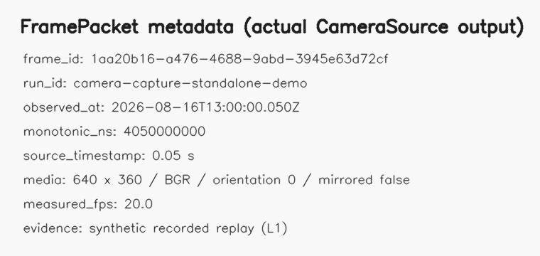
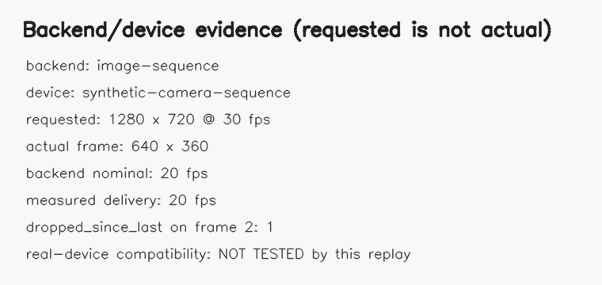

# Camera Capture Sensor

## 摄像头采集软件传感器

> 从本机摄像头或录制图像序列持续取得画面，并把每一帧封装成带时间、尺寸、颜色空间、后端和丢帧信息的 FramePacket。

**状态：experimental / incubating** · **Sensor ID：** `camera.capture` · **实现版本：** `0.3.0` · **契约版本：** `1.0.0`

## 典型物理实验用途

来源项目用摄像头拍摄人物、颜色标记和红色光斑，为轨迹、振动与视觉—声音同步实验提供原始图像。这个 source 直接测到的是摄像头像素帧；位置、速度、光斑重心和物理位移都必须由下游 processor 与独立标定得到。**图像像素不等于物理量。**

## 来源项目

| 项目 | 仓库 | commit | 原实现文件/符号 | 实际用途 |
| --- | --- | --- | --- | --- |
| 声音—视觉稳定版 | [`audio-visual-soundfield-tracker-stable`](https://github.com/WUHAO19831214/audio-visual-soundfield-tracker-stable) | `85740d686c67452a057540edb564d713e01ccc51` | `src/camera_devices.py::open_camera`；`src/local_capture.py::LocalCameraWorker.start/_run/stop`；`src/browser_capture.py::*VideoProcessor.recv` | OpenCV/WebRTC 帧进入视觉与同步链路 |
| 光斑追踪系统 | [`spot-vibration-tracking-system-20260508-171952`](https://github.com/WUHAO19831214/spot-vibration-tracking-system-20260508-171952) | `7f0d91cc73afafaecc54acc46b2b9d69375d994a` | `app.js::requestCamera/stopCamera/trackRedSpot` | `getUserMedia` 视频经 canvas 进入光斑处理 |
| 受迫振动系统 | [`forced-vibration-af-analyzer-20260502-122715`](https://github.com/WUHAO19831214/forced-vibration-af-analyzer-20260502-122715) | `c3f58175a09ff29cacdfb976a5055758c4eff619` | `app.js::requestCamera/stopCamera/trackRedSpot` | 摄像头帧用于红色光斑振动输入 |
| 多源实验桥 | [`physics-experiment-bridge-mvp`](https://github.com/WUHAO19831214/physics-experiment-bridge-mvp) | `8bba87df6475cae1e595fc925551db8bea83fb68` | `src/camera/CameraCapturePanel.tsx`、`src/utils/cameraUtils.ts` | 浏览器摄像头、video/canvas 与视觉采样 |
| 安培力教师端 | [`ampere-force-visualizer-teacher-yanan`](https://github.com/WUHAO19831214/ampere-force-visualizer-teacher-yanan) | `cb073e89d6d87129287030f1df08bd540504eb39` | 同名 camera 文件 | 教师端视觉输入，后续分析与课堂 store 分离 |

完整文件级差异见 [SOURCE.md](SOURCE.md)。

## 工作原理

```text
Camera backend / recorded frames
          ↓
read pixels + backend timestamp
          ↓
wall clock + monotonic clock
          ↓
requested / nominal / measured rate 分开记录
          ↓
artifact hash + quality/drop metadata
          ↓
RuntimeFrame(metadata=FramePacket, pixels=BGR)
```

`CameraSource` 不执行颜色追踪、YOLO、模板追踪或物理标定。

## 输入

- `CameraBackend`：当前有 `ImageSequenceCameraBackend` 与可选 `OpenCVCameraBackend`；
- 请求宽高、`requested_fps`、镜像、方向和 artifact URI 前缀；
- `SensorContext.run_id`；
- recorded backend 可提供源时间戳、确定性 wall/monotonic 时间和丢帧标记。

## 输出

每帧输出 `RuntimeFrame`。`metadata` 是 Schema `1.0.0` 的 FramePacket，pixels 只在进程内绑定，不进入 JSON。

```json
{
  "schema_version": "1.0.0",
  "frame_id": "81000000-0000-4000-8000-000000000002",
  "run_id": "camera-replay",
  "source_sensor_id": "camera.capture",
  "sequence": 1,
  "observed_at": "2026-08-16T12:00:00.050Z",
  "monotonic_ns": 1050000000,
  "source_timestamp": 0.05,
  "media": {"kind": "camera-frame", "media_type": "application/x-raw-bgr", "width": 3, "height": 2, "color_space": "BGR", "orientation": "0", "mirrored": false},
  "quality": {"dropped_since_last": 1, "flags": ["recorded-replay", "frame-dropped"]},
  "payload": {"capture": {"backend": "image-sequence", "requested": {"width": 1920, "height": 1080, "fps": 30.0}, "actual": {"width": 3, "height": 2, "nominal_fps": 20, "measured_fps": 20.0}}}
}
```

完整 replay 输出见 [assets/replay-frame-packets.json](assets/replay-frame-packets.json)。

## 使用效果

| Captured frame | FramePacket metadata | Backend evidence |
| --- | --- | --- |
| [](assets/captured-frame.png) | [](assets/frame-packet-metadata.png) | [](assets/backend-information.png) |

三图由本仓库 `CameraSource` standalone replay 实际生成；输入是明确标注的 synthetic image sequence，不是来源项目截图或真实硬件证据。

## 最小调用示例

```python
from physics_sensors.capture import CameraSource, ImageSequenceCameraBackend

source = CameraSource(ImageSequenceCameraBackend(recorded_frames, nominal_fps=20))
source.configure({"requested_fps": 30})
await source.start(SensorContext.minimal("run-001"))
async for frame in source.read():
    consume(frame)
await source.stop()
```

可运行示例及显式硬件 smoke 入口见 [`examples/python-camera-capture`](../../examples/python-camera-capture/README.md)。

## 当前成熟度

`incubating / adapter-present / replay-benchmarked`。确定性 source、OpenCV backend、契约测试和示例已存在；未做真实相机兼容矩阵、长期稳定性或硬件时间戳验证，因此不是 `validated/stable`。

## 已知限制

- configured FPS、backend nominal FPS、逐帧 measured FPS 是三个不同字段；单帧不能计算 measured FPS；
- OpenCV `CAP_PROP_POS_MSEC` 并非所有实时摄像头都提供有效硬件时间戳；缺失时为 `null`；
- browser camera 尚未在 package 内实现，仅由统一 backend/FramePacket 边界规划；
- synthetic replay 不证明权限、曝光、黑帧、拔插恢复、CPU/内存或真实掉帧行为；
- 输出是图像，不是物理位移或计量结果。

## Benchmark

[协议与当前结果](benchmarks/README.md) · [Phase 3A replay 报告](../../benchmarks/results/phase3a-capture-replay-2026-08-16.md)

## Provenance

[SOURCE.md](SOURCE.md) · [sensor.json](sensor.json) · [CHANGELOG.md](CHANGELOG.md)

## Distribution

- Maturity/evidence: `experimental / E1`.
- Implementation: `physics_sensors.capture.CameraSource` in Python package `0.5.0`.
- Proposed bundle: `camera.capture-0.3.0.zip` (documentation/example bundle; package core is not copied).
- Install/download: [installation](../../docs/installation.md) · [downloading sensors](../../docs/downloading-sensors.md).
- Minimal runnable example: [python-camera-capture](../../examples/python-camera-capture/README.md).
