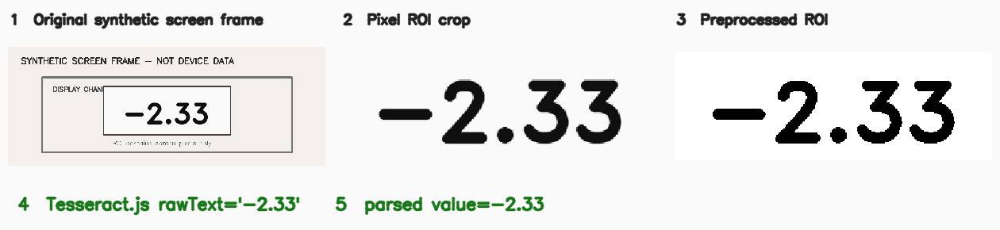

# Number OCR Sensor

## 数字 OCR 软件传感器

> 从用户授权的屏幕或录制图像中裁定一个数字区域，保留 OCR 原文并解析出数值，用于读取实验设备原软件已经显示在屏幕上的读数。

**状态：experimental**
**Sensor ID：** `ocr.number`
**实现版本：** `0.2.0`

## 典型物理实验用途

多源实验桥和安培力教师端使用浏览器 `getDisplayMedia` 获取用户选择的实验软件窗口，再对力传感器通道 ROI 运行 Tesseract.js。它的真实链路是：

```text
力传感器 → 原设备/软件 → 屏幕显示 → 用户授权的屏幕像素 → OCR → 数值
```

因此本传感器直接观测的是**屏幕 ROI 中的数字图像和 OCR 文本**，不是朗威 DIS 或其他设备 SDK 的内部数据。单位、通道含义、零点和物理范围由调用方配置并验证。

## 来源项目

| 项目 | 仓库 | commit | 原实现文件 | 原始类/函数 | 用途 |
| --- | --- | --- | --- | --- | --- |
| 多源实验桥 | [`physics-experiment-bridge-mvp`](https://github.com/WUHAO19831214/physics-experiment-bridge-mvp) | `8bba87df6475cae1e595fc925551db8bea83fb68` | `src/recognizers/TesseractRecognizer.ts` | `TesseractRecognizer.recognize` | 对屏幕 OCR ROI 运行本地 Tesseract.js，保留 rawText/value/confidence/duration/warning |
| 同上 | 同上 | 同上 | `src/utils/extractNumber.ts` | `normalizeOcrText`、`extractNumberFromText` | OCR 易混字符归一化与普通十进制解析 |
| 同上 | 同上 | 同上 | `src/utils/imagePreprocess.ts`、`ocrPreprocess.ts` | `cropRoiFromVideo`、`preprocessForNumberRecognition`、`preprocessForLangweiNumber` | ROI 裁剪、放大、灰度/阈值和去噪 |
| 同上 | 同上 | 同上 | `src/screen/ScreenCapturePanel.tsx` | `ScreenCapturePanel` 内采样循环 | 屏幕授权、ROI、OCR、过滤和 store 的原业务编排 |
| 安培力教师端 | [`ampere-force-visualizer-teacher-yanan`](https://github.com/WUHAO19831214/ampere-force-visualizer-teacher-yanan) | `cb073e89d6d87129287030f1df08bd540504eb39` | 同名 recognizer/utils/screen 文件 | 同上 | 读取 Fy/Fz 屏幕显示并服务教师端可视化 |

两个来源 commit 中五个核心 OCR/解析/预处理文件的 SHA-256 完全一致，详见 [SOURCE.md](SOURCE.md)。

## 工作原理

```text
screen/image FramePacket + runtime RGBA pixels
  ↓
验证帧尺寸并裁剪归一化 ROI
  ↓
4× nearest-neighbor + 灰度/对比度/阈值/去噪
  ↓
TesseractJsRecognizer（worker 可复用、可关闭）
  ↓
保留 rawText、confidence、duration、warning/error
  ↓
按来源规则归一化易混字符并提取普通十进制
  ↓
成功：measurement + SensorEvent
失败：空 measurements + error，绝不回退 mock 数字
```

`NumberRecognizer` seam 保持不变：`RecordedNumberRecognizer` 继续提供确定性回放，`TesseractJsRecognizer` 执行真实像素 OCR。本轮没有迁入 React UI、`getDisplayMedia`、Zustand/store 或教师端业务。

## 输入

- screen/image `FramePacket` 的 ID、run ID、观测时间、单调时间、尺寸和 artifact URI；
- runtime `pixels`：与媒体尺寸一致的 RGBA `Uint8ClampedArray`；
- `[0,1]` 归一化 OCR ROI；
- 通道名称、符号和单位；
- 实现 `NumberRecognizer` 的识别后端；
- `RecordedNumberRecognizer` 按 frame/ROI 回放固定结果；`TesseractJsRecognizer` 处理真实 pixels。

Node runner 使用 PNG buffer；浏览器路径使用 Canvas。Tesseract `eng` traineddata 不打包进本仓库，首次运行可能需要获取并缓存。

## 输出

成功事件至少保留：

- measurement：`recognized_value`；
- `payload.raw_text` 与 `payload.normalized_text`；
- `payload.confidence`、`payload.duration_ms`、`payload.warning`；
- ROI、recognizer ID 和 frame parent ID。

```json
{
  "sensor": {"id": "ocr.number", "version": "0.2.0", "category": "processor"},
  "status": "ok",
  "quality": {"confidence": 0.94, "latency_ms": 42, "flags": ["recorded-replay"], "dropped_since_last": 0},
  "measurements": [
    {"name": "recognized_value", "value": -2.33, "value_type": "number", "unit": "N", "role": "derived", "uncertainty": null}
  ],
  "payload": {"raw_text": "-2.33", "normalized_text": "-2.33", "recognizer": "tesseract"}
}
```

若 rawText 无法解析，输出 `status: "error"`、`OCR_PARSE_FAILED` 和 `ocr-parse-failed`；如果 recognizer 本身失败，输出 `OCR_RECOGNITION_FAILED`。两种情况都没有数值 measurement。

完整、通过 SensorEvent Schema 的 replay 输出见 [`examples/recorded-success-event.json`](examples/recorded-success-event.json)。

## 使用效果


*Generated by the standalone sensor example / Synthetic test fixture.* 红框是实际 pixel ROI，底部 rawText 和 parsed value 来自本次 Tesseract.js SensorEvent。画面不是来源项目、朗威设备或真实实验截图。



组合图展示实际 `Original → ROI crop → preprocessing → Tesseract.js → parsed value` 路径。生成命令、SHA-256 和证据边界见 [assets/README.md](assets/README.md)。

## 最小调用示例

```ts
import { NumberOCRSensor, TesseractJsRecognizer } from '@physics-software-sensors/core';

const recognizer = new TesseractJsRecognizer({
  psmMode: 'SINGLE_WORD',
  whitelist: '0123456789.+-',
});
const sensor = new NumberOCRSensor(recognizer);
sensor.configure({ roiId: 'force-y', roi: { x: 0.36, y: 0.535, width: 0.28, height: 0.05 }, unit: 'N' });
await sensor.start({ runId: 'experiment-001' });

const event = await sensor.processFrame(runtimeRgbaFramePacket);
console.log(event.payload.raw_text, event.measurements);
await sensor.stop();
```

完整可运行的 Node pixel fixture runner 见 [examples/README.md](examples/README.md)。它不依赖原实验 UI。

## 当前成熟度

`experimental` / manifest `incubating`：parser、RGBA ROI、预处理、真实 Tesseract.js backend、统一事件、recorded replay 和 synthetic pixel integration 均可独立运行；尚无真实设备/屏幕数据集、浏览器兼容矩阵或 L2 准确率验证，因此不是 validated/stable。

## 已知限制

- 来源默认 whitelist 为 `0123456789.-`；调用方可显式加入 `+`，但仍不支持科学计数法；
- synthetic fixture 成功不代表朗威设备字体、缩放和刷新环境已经验证；
- Tesseract.js worker/语言数据初始化会增加首次调用延迟；
- 来源易混字符规则会把单词中的 `o/O` 变成 `0`；必须保留 rawText，并用物理范围/上下文防止误接受；
- OCR 置信度是引擎元数据，不是物理测量置信区间；
- 屏幕缩放、字体、背景线、颜色和刷新方式会影响真实识别；
- OCR 后处理误差必须与设备传感器本身误差分开报告；
- 失败不会自动回退到 mock，也不会沿用上次有效数值作为当前测量。

## Benchmark

见 [benchmarks/README.md](benchmarks/README.md)、[synthetic pixel dataset card](../../benchmarks/datasets/ocr-number-synthetic-pixels/dataset-card.md) 和 [Phase 2D result](../../benchmarks/results/phase2d-demonstration-2026-08-16.md)。固定 synthetic 数字为 3/3 exact numeric match；真实设备 exact match、数值误差和 latency 分布仍待 recorded frames。

## Provenance

- [SOURCE.md](SOURCE.md)
- [sensor.json](sensor.json)
- [仓库级来源盘点](../../docs/source-inventory.md)
