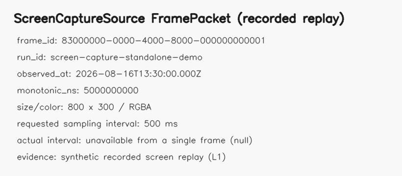
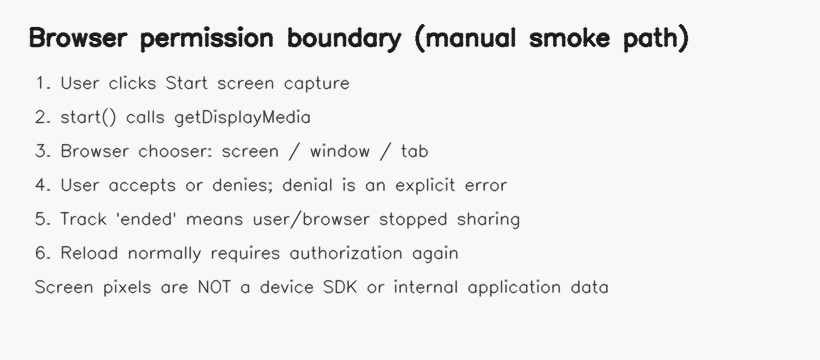

# Screen Capture Sensor

## 屏幕/窗口采集软件传感器

> 在用户主动授权后，把所选屏幕、窗口或浏览器标签页的像素封装成 FramePacket，供 OCR 或视觉 processor 使用。

**状态：experimental / incubating** · **Sensor ID：** `screen.capture` · **实现版本：** `0.3.0` · **契约版本：** `1.0.0`

## 典型物理实验用途

多源实验桥与安培力教师端把原实验软件界面上显示的力/位移等数字转成图像，再交给 OCR。`screen.capture` 直接取得的是**用户授权的屏幕像素**，不是设备 SDK、串口、数据库或应用内部数据。数字、单位、滤波和物理解释全是下游职责。

## 来源项目

| 项目 | 仓库 | commit | 原实现文件/符号 | 实际用途 |
| --- | --- | --- | --- | --- |
| 多源实验桥 | [`physics-experiment-bridge-mvp`](https://github.com/WUHAO19831214/physics-experiment-bridge-mvp) | `8bba87df6475cae1e595fc925551db8bea83fb68` | `src/screen/ScreenCapturePanel.tsx::startCapture/stopCapture`；`src/screen/screenCaptureRuntime.ts::set/getScreenCaptureVideoElement`；`docs/SCREEN_CAPTURE_PIPELINE.md` | `getDisplayMedia` 授权、video 流、定时采样后进入 ROI/OCR |
| 安培力教师端 | [`ampere-force-visualizer-teacher-yanan`](https://github.com/WUHAO19831214/ampere-force-visualizer-teacher-yanan) | `cb073e89d6d87129287030f1df08bd540504eb39` | `src/screen/ScreenCapturePanel.tsx::startCapture/stopCapture`；`src/utils/imagePreprocess.ts::cropRoiFromVideo`；`docs/SENSOR_INTEGRATION.md` | 教师工作流的 Fy/Fz 屏幕像素桥接 |

完整文件级差异见 [SOURCE.md](SOURCE.md)。

## 工作原理

```text
用户点击 start()
       ↓
getDisplayMedia chooser（屏幕 / 窗口 / 标签页）
       ↓
video 解码 → canvas RGBA pixels
       ↓
wall clock + monotonic clock + sampling metadata
       ↓
RuntimeFramePacket
       ↓
OCR / vision processor（不属于 screen.capture）
```

构造、`describe()` 和 `configure()` 都不会请求权限；浏览器 backend 的 `start()` 才是权限边界。

## 输入

- 浏览器 `BrowserScreenBackend`，或测试/回放用 `RecordedScreenBackend`；
- `requestedIntervalMs` 与 artifact URI 前缀；
- 浏览器 chooser 中由用户选择的共享源；网页不能静默指定或读取桌面；
- `SensorContext.runId`。

## 输出

`RuntimeFramePacket` 提供 RGBA pixels；`serializeRuntimeFramePacket()` 生成 Schema `1.0.0` JSON 并移除 runtime pixels。

```json
{
  "schema_version": "1.0.0",
  "frame_id": "83000000-0000-4000-8000-000000000001",
  "run_id": "screen-capture-standalone-demo",
  "source_sensor_id": "screen.capture",
  "sequence": 0,
  "observed_at": "2026-08-16T13:30:00.000Z",
  "monotonic_ns": 5000000000,
  "source_timestamp": 12.5,
  "media": {"kind": "screen-frame", "media_type": "application/x-raw-rgba", "width": 800, "height": 300, "color_space": "RGBA", "orientation": "0", "mirrored": false},
  "quality": {"dropped_since_last": 0, "flags": ["synthetic-fixture", "recorded-replay"]},
  "payload": {"capture": {"backend": "recorded-screen", "user_authorized": false, "requested": {"sampling_interval_ms": 500}, "actual": {"measured_interval_ms": null, "measured_rate_hz": null, "width": 800, "height": 300}}}
}
```

完整输出见 [assets/replay-frame-packet.json](assets/replay-frame-packet.json)。Replay 的 `user_authorized=false` 表示它没有冒充一次浏览器授权。

## 使用效果

| Recorded screen pixels | FramePacket metadata | Permission boundary |
| --- | --- | --- |
| [](assets/captured-screen-frame.png) | [](assets/frame-packet-metadata.png) | [](assets/permission-boundary.png) |

三图来自本仓库 recorded replay/文档化权限流程；不是来源项目 UI、真实设备界面或浏览器兼容证明。

## 最小调用示例

```ts
import { BrowserScreenBackend, ScreenCaptureSource } from '@physics-software-sensors/core';

button.onclick = async () => {
  const source = new ScreenCaptureSource(new BrowserScreenBackend());
  source.configure({ requestedIntervalMs: 500 });
  await source.start({ runId: 'run-001' }); // must remain inside the user gesture
  for await (const frame of source.read()) consume(frame);
};
```

[Recorded 与真实浏览器最小示例](../../examples/web-screen-capture/README.md) · [Screen → OCR composition](../../examples/web-screen-to-ocr/README.md)

## 当前成熟度

`incubating / adapter-present / replay-benchmarked`。recorded source、实际浏览器 driver、permission/error unit tests、FramePacket contract test 与真实 Tesseract composition 已存在；尚无正式浏览器/OS 矩阵或人工 smoke 报告，因此不是 `validated/stable`。

## 权限与错误语义

- 用户必须显式授权，并选择整个屏幕、窗口或标签页；刷新后通常重新授权；
- 拒绝映射为 `SCREEN_CAPTURE_PERMISSION_DENIED`，共享被结束映射为 `SCREEN_CAPTURE_ENDED`；
- capture failure 不等于实验设备失败；它可能是权限、浏览器支持、视频未就绪或用户结束；
- display refresh rate、track `frameRate`、requested sampling interval 与 measured delivery interval 分开记录；
- screen capture 只输出像素，绝不在失败后返回 mock 数字。

## 已知限制

- 浏览器安全策略要求 `getDisplayMedia` 在安全上下文及用户动作中调用；
- 单帧无法计算实际采样间隔；browser scheduling、窗口遮挡/缩放与平台行为需要 L2/L3 测试；
- `sourceTimestamp` 当前 browser canvas path 为 `null`，不伪装成硬件/应用时间；
- 屏幕像素经缩放、抗锯齿、主题和遮挡改变后会影响下游 OCR；
- 输出不是设备 SDK 数据或已校准物理值。

## Benchmark

[协议与当前结果](benchmarks/README.md) · [Phase 3A replay 报告](../../benchmarks/results/phase3a-capture-replay-2026-08-16.md)

## Provenance

[SOURCE.md](SOURCE.md) · [sensor.json](sensor.json) · [CHANGELOG.md](CHANGELOG.md)

## Distribution

- Maturity/evidence: `experimental / E1`.
- Implementation: `ScreenCaptureSource` in TypeScript package `0.3.0`.
- Proposed bundle: `screen.capture-0.3.0.zip`; requires the shared tgz and does not copy core.
- Install/download: [installation](../../docs/installation.md) · [downloading sensors](../../docs/downloading-sensors.md).
- Minimal runnable example: [web-screen-capture](../../examples/web-screen-capture/README.md).
