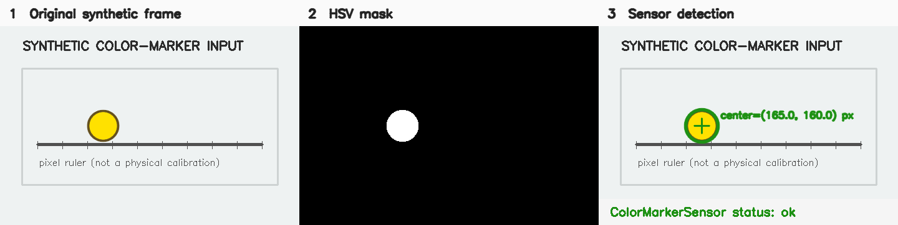

# Color Marker Tracker

## 颜色标记视觉追踪软件传感器

> 从摄像头图像中寻找指定 HSV 颜色的实验标记物，并连续输出其二维图像位置、轮廓质量和丢失状态，可用于运动、振动与轨迹实验的数据采集。

**状态：experimental**
**Sensor ID：** `tracker.color-marker`
**实现版本：** `0.2.0`

## 典型物理实验用途

该算法在“声音—视觉同步采集稳定版”中用于追踪明亮网球色标记，把标记中心与同步音频特征关联；浏览器实验桥中也存在颜色/标记分析策略。

它直接测到的是：

- 摄像头图像中的标记中心 `center_x/center_y`（pixel）；
- 图像轮廓面积、近似半径和圆度；
- 当前帧是否锁定以及连续丢失帧数。

只有经过标尺或相机标定，且相机、标记和运动平面满足实验假设后，像素位置才可以换算成长度或位移。**像素位置不等于物理位移。**

## 来源项目

| 项目 | 仓库 | commit | 原实现文件 | 原始类/函数 | 用途 |
| --- | --- | --- | --- | --- | --- |
| 声音—视觉同步采集稳定版 | [`audio-visual-soundfield-tracker-stable`](https://github.com/WUHAO19831214/audio-visual-soundfield-tracker-stable) | `85740d686c67452a057540edb564d713e01ccc51` | `src/tennis_ball_tracker.py` | `TennisBallTracker.update`、`make_tennis_mask`、`find_ball_candidates`、`choose_best_candidate` | 追踪明亮网球色标记并输出视觉—音频融合所需位置 |
| 多源实验桥 | [`physics-experiment-bridge-mvp`](https://github.com/WUHAO19831214/physics-experiment-bridge-mvp) | `8bba87df6475cae1e595fc925551db8bea83fb68` | `src/vision/ColorTrackingAnalyzer.ts`、`MarkerTrackingAnalyzer.ts` | `analyze` | 浏览器摄像头视觉分析策略；本轮未抽取 |

完整文件级记录见 [SOURCE.md](SOURCE.md)。

## 工作原理

```text
BGR 摄像头帧
  ↓
转换到 HSV 颜色空间
  ↓
按 H/S/V 阈值生成二值 mask
  ↓
5×5 椭圆核开运算 + 闭运算
  ↓
提取外轮廓并计算面积、圆度、包围圆
  ↓
按面积/圆度过滤；优先选择接近上一位置的候选
  ↓
指数平滑中心位置；生成 tracking / lost 状态
  ↓
保留 source_raw，并映射为统一 SensorEvent
```

色相跨越 OpenCV HSV 的 0/179 边界时会组合两个 mask。首次选择使用面积×圆度评分，后续选择偏向空间连续性。

## 输入

- `RuntimeFrame`：其 metadata 满足 `FramePacket`，pixels 为 NumPy `uint8` BGR 三通道数组；
- HSV 下/上界；
- 最小/最大轮廓面积；
- 最小圆度；
- 中心平滑系数；
- 可选标记类别名称和 track ID。

本实现不依赖 Streamlit、摄像头 UI、音频采集或来源项目的业务 store。

## 输出

核心 measurements：`center_x`、`center_y`、`bbox_width`、`bbox_height`、`marker_radius`、`marker_area`、`marker_circularity`。坐标系显式记录为 `image-pixel`。来源格式完整保存在 `payload.source_raw`。

```json
{
  "sensor": {"id": "tracker.color-marker", "version": "0.2.0", "category": "processor"},
  "status": "ok",
  "quality": {"confidence": 0.91, "flags": [], "dropped_since_last": 0},
  "measurements": [
    {"name": "center_x", "value": 80.0, "value_type": "number", "unit": "px", "role": "filtered", "uncertainty": null},
    {"name": "center_y", "value": 60.0, "value_type": "number", "unit": "px", "role": "filtered", "uncertainty": null}
  ],
  "payload": {"algorithm": "hsv-contour-marker", "source_raw": {"tracking_status": "tracking"}}
}
```

丢失时输出 `status: "lost"`、空 measurements 和 `target-lost`，不会沿用上一位置伪装当前测量。

完整、通过 SensorEvent Schema 的适配输出见 [`examples/tracking-event.json`](examples/tracking-event.json)。

## 使用效果


*Generated by the standalone sensor example / Synthetic test fixture.* 图中的输入由本仓库脚本生成，绿色中心、包围圆和状态来自真实 `ColorMarkerSensor` 事件；不是来源项目截图、真实实验数据或物理标定。



三联图中的 mask 是本次 adapter 运行产生的实际 HSV mask。另见 [lost/reacquire sequence](assets/lost-reacquire.png)、[生成命令与 SHA-256](assets/README.md)。

## 最小调用示例

```python
import asyncio

from physics_sensors.core import RuntimeFrame, SensorContext
from physics_sensors.tracking import ColorMarkerSensor

async def main():
    sensor = ColorMarkerSensor()
    sensor.configure({"hsv_lower": [20, 100, 100], "hsv_upper": [40, 255, 255]})
    await sensor.start(SensorContext.minimal(run_id="experiment-001"))

    frame = RuntimeFrame(metadata=frame_packet, pixels=bgr_numpy_array)
    async for event in sensor.process(frame):
        print(event["measurements"])

    await sensor.stop()

asyncio.run(main())
```

安装实验性颜色追踪依赖：

```bash
python -m pip install -e 'packages/python[color-marker]'
```

完整说明见 [examples/README.md](examples/README.md)。

## 当前成熟度

`experimental` / manifest `incubating`：已有独立 Python 算法层、统一事件 adapter、固定 golden fixture、来源同帧比较工具和可运行的 standalone visualization；尚未完成真实摄像头 L2 验证、公开实验数据集、CPU/内存基准或下游接入，因此不是 validated/stable。

## 已知限制

- HSV 阈值依赖摄像头、曝光、白平衡、光照和背景；
- 圆度当前被映射为 confidence，但未做概率校准；
- 多个相似颜色目标可能导致错误锁定；
- 当前连续性策略不是卡尔曼滤波，也不提供速度预测；
- `max_lost_frames` 保留来源配置语义，但来源算法并未据此自动重捕获或终止；
- 输出是图像坐标；物理单位换算不属于本传感器。

## Benchmark

见 [benchmarks/README.md](benchmarks/README.md) 和 [Phase 2D demonstration result](../../benchmarks/results/phase2d-demonstration-2026-08-16.md)。当前只完成 L0、合成帧 L1 来源兼容与 standalone demo，不声称真实实验精度。

## Provenance

- [SOURCE.md](SOURCE.md)
- [sensor.json](sensor.json)
- [仓库级来源盘点](../../docs/source-inventory.md)

## Distribution

- Maturity/evidence: `experimental / E2`.
- Implementation: `physics_sensors.tracking.ColorMarkerSensor` in Python package `0.5.0` with `color-marker` extra.
- Proposed bundle: `tracker.color-marker-0.2.0.zip`; requires the wheel and does not copy core.
- Install/download: [installation](../../docs/installation.md) · [downloading sensors](../../docs/downloading-sensors.md).
- Minimal runnable example: [python-color-marker](../../examples/python-color-marker/README.md).
