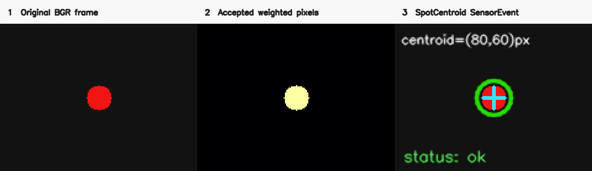
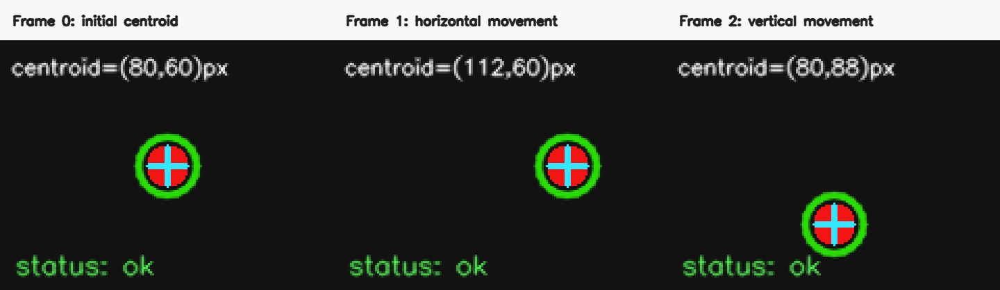

# Spot Centroid Tracker

## 光斑重心识别软件传感器

> 从图像中筛选符合来源红色条件的亮像素，并按亮度权重输出光斑的二维图像重心，供振动、轨迹和光学实验后续分析使用。

**状态：experimental** · **Sensor ID：** `tracker.spot-centroid` · **实现版本：** `0.4.0`

## 典型物理实验用途

固定来源项目把红色光斑的图像重心随时间记录下来，用于观察振动轨迹和后续扫频分析。本传感器直接观测：

- `centroid_x / centroid_y`：图像重心，单位 pixel；
- 候选像素面积、权重总和、峰值亮度和包围范围；
- 当前帧是否检测到光斑，以及可由像素证据判断的弱信号、过曝、ROI 边缘状态。

**像素重心不是机械位移，更不是振幅。** 从摄像机/光路观测得到物理长度，需要在目标运动平面建立空间标定并验证实验几何假设。

## 来源项目

| 项目 | 仓库 | commit | 原实现文件 | 原始函数 | 原项目用途 |
| --- | --- | --- | --- | --- | --- |
| 光斑追踪系统 | [`spot-vibration-tracking-system-20260508-171952`](https://github.com/WUHAO19831214/spot-vibration-tracking-system-20260508-171952) | `7f0d91cc73afafaecc54acc46b2b9d69375d994a` | `app.js` | `rgbToHsv`、`trackRedSpot`、`getAmplitudeFrom` | 红色加权重心、图像轨迹和扫频窗口 |
| 受迫振动系统 | [`forced-vibration-af-analyzer-20260502-122715`](https://github.com/WUHAO19831214/forced-vibration-af-analyzer-20260502-122715) | `c3f58175a09ff29cacdfb976a5055758c4eff619` | `app.js` | `rgbToHsv`、`trackRedSpot`、`getAmplitudeFrom` | 红色光斑图像范围与设定频率关联 |

两个固定 commit 的 `trackRedSpot` 核心阈值和权重公式一致。完整文件级抽取与比较记录见 [SOURCE.md](SOURCE.md)。

## 工作原理

```text
BGR FramePacket
  ↓
归一化 ROI（可选）
  ↓
RGB → HSV；红色 hue + saturation/value + 强红通道差联合筛选
  ↓
按来源公式计算 brightness weight
  ↓
候选像素、权重和、bbox、过曝比例和 ROI 边缘证据
  ↓
超过 lost threshold 时计算 weighted centroid
  ↓
image-pixel SensorEvent；否则显式 spot-lost
```

默认阈值、宽图 `step=2` 采样和 `weightSum > 900` 锁定条件与固定来源一致。0.4.0 只接受 `color_channel="red"`，没有为了“通用化”擅自替换算法。

## 输入

- `RuntimeFrame`：metadata 满足 FramePacket `1.0.0`，pixels 为 NumPy BGR 数组；
- normalized ROI；
- red hue、saturation/value 和 RGB 通道差阈值；
- `brightness_weighting`、`minimum_candidate_pixels`、`lost_weight_threshold`；
- `overexposure_value / overexposure_fraction`。

## 输出

核心 measurements 为 `centroid_x`、`centroid_y`、`spot_area`、`spot_intensity_sum`、`peak_intensity`，并保留可靠 bbox 宽高。`quality.confidence` 固定为 `null`，因为来源算法没有经校准的置信度。

```json
{
  "sensor": {"id": "tracker.spot-centroid", "version": "0.4.0", "category": "processor"},
  "status": "ok",
  "measurements": [
    {"name": "centroid_x", "value": 80.0, "value_type": "number", "unit": "px", "role": "raw", "uncertainty": null},
    {"name": "centroid_y", "value": 60.0, "value_type": "number", "unit": "px", "role": "raw", "uncertainty": null},
    {"name": "spot_intensity_sum", "value": 71325.0, "value_type": "number", "unit": "1", "role": "raw", "uncertainty": null}
  ],
  "quality": {"confidence": null, "flags": [], "dropped_since_last": 0},
  "coordinate_frame": {"space": "image-pixel", "unit": "px", "calibration_id": null},
  "payload": {"source_projection": {"locked": true, "x": 80.0, "y": 60.0, "weight_sum": 71325.0}}
}
```

丢失帧没有重心 measurements，也不会复用上一帧位置。可能的证据型 flag：`spot-lost`、`low-signal`、`overexposed`、`roi-edge`。

## 使用效果






图片由本仓库 standalone example 的真实 adapter 输出生成，输入明确为 synthetic；不是来源截图、真实实验数据或物理标定证据。生成命令和 SHA-256 见 [assets/README.md](assets/README.md)。

## 最小调用示例

```python
from physics_sensors.core import SensorContext
from physics_sensors.tracking import SpotCentroidSensor

sensor = SpotCentroidSensor()
sensor.configure({"roi": {"x": 0, "y": 0, "width": 1, "height": 1}})
await sensor.start(SensorContext.minimal("experiment-001"))
event = sensor.process_frame(runtime_frame)
await sensor.stop()
```

安装与可运行的 Camera composition 见 [standalone example](../../examples/spot-centroid/README.md)。

## Derived physics quantities

本传感器只负责产生 `centroid pixel time series`。后续应用可独立完成：

```text
pixel series → spatial calibration → displacement
time series → amplitude / period / frequency
```

空间标定、位移、振幅、周期和频率分析不属于 `tracker.spot-centroid`，也不会被塞入其 SensorEvent 冒充直接观测。

## 当前成熟度

`experimental` / manifest `incubating`：已有独立 Python 实现、来源执行型 golden、六帧合成回放、CameraSource composition、Schema 测试和微基准。尚无真实摄像头 L2 数据集、曝光/光路系统验证、计量不确定度或下游项目接入。

## 已知限制

- 只实现来源兼容红色 profile；背景红色会成为候选；
- 曝光、中心发白、散斑、拖影、反射和 ROI 截断会移动图像重心；
- `overexposed` 是像素阈值警告，不是相机饱和度计量；
- 输出是当前帧原始重心，不做轨迹滤波；
- source compatibility 与 synthetic benchmark 不证明真实实验精度。

## Benchmark 与 Provenance

[本传感器 benchmark](benchmarks/README.md) · [Phase 3B 结果](../../benchmarks/results/phase3b-classical-trackers-2026-08-16.md) · [SOURCE.md](SOURCE.md) · [sensor.json](sensor.json)

## Distribution

- Maturity/evidence: `experimental / E2`.
- Implementation: `physics_sensors.tracking.SpotCentroidSensor` in Python package `0.5.0` with `classical-trackers` extra.
- Proposed bundle: `tracker.spot-centroid-0.4.0.zip`; requires the wheel and does not copy core.
- Install/download: [installation](../../docs/installation.md) · [downloading sensors](../../docs/downloading-sensors.md).
- Minimal runnable example: [spot-centroid](../../examples/spot-centroid/README.md).
