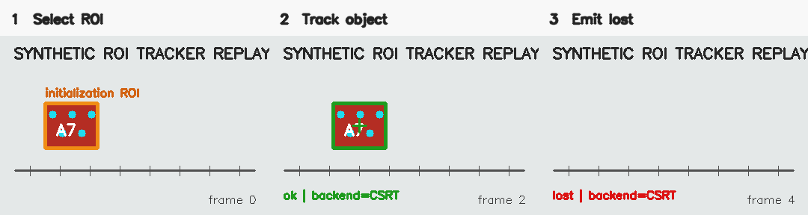

# Template / Single-Object Tracker

## 模板/单目标追踪软件传感器

> 用户在第一帧框选一个实验目标，传感器使用 OpenCV 单目标 tracker 在后续图像中持续输出其边界框、中心、实际 backend 和丢失状态。

**状态：experimental** · **Sensor ID：** `tracker.template` · **实现版本：** `0.4.0`

## 先说明名称边界

保留既有 Sensor ID `tracker.template` 以避免破坏 Phase 1 契约，但本轮抽取的真实来源算法是 **ROI-initialized OpenCV single-object tracker**，不是 normalized cross-correlation 等静态模板匹配。

- **Initialization ROI**：首帧上的 `(x, y, width, height)`，用于初始化 tracker；本实现必须提供。
- **Template asset**：独立保存/传入的参考图像。本实现只可把 URI 作为 provenance metadata，不用它做静态模板匹配。

## 典型物理实验用途

声音—视觉同步采集稳定版允许用户选择自定义物体 ROI，并用 `CSRT → KCF → MIL` 追踪图像位置。直接观测是图像中的 bbox 和中心 pixel；经过独立空间标定后，应用才可能换算位移。遮挡、尺度变化和 backend fallback 都会改变结果。

## 来源项目

| 项目 | 仓库 | commit | 原实现文件 | 原始类/函数 | 本轮用途 |
| --- | --- | --- | --- | --- | --- |
| 声音—视觉同步采集稳定版 | [`audio-visual-soundfield-tracker-stable`](https://github.com/WUHAO19831214/audio-visual-soundfield-tracker-stable) | `85740d686c67452a057540edb564d713e01ccc51` | `src/object_template_tracker.py` | `ObjectTemplateTracker.initialize/update/reset`、`create_opencv_tracker`、`validate_bbox` | 本轮实际抽取：ROI tracker、fallback、lost/reinitialize |
| 同仓测试 | 同上 | 同上 | `tests/test_object_template_tracker.py` | bbox、backend availability、init failure、pre-init update 测试 | 确认来源边界与非致命失败语义 |
| 多源实验桥 | [`physics-experiment-bridge-mvp`](https://github.com/WUHAO19831214/physics-experiment-bridge-mvp) | `8bba87df6475cae1e595fc925551db8bea83fb68` | `src/vision/TemplateMatchingAnalyzer.ts` | `analyze` | 相关但不同的静态 template-matching profile；本轮未抽取 |

完整追溯见 [SOURCE.md](SOURCE.md)。

## 工作原理

```text
initial FramePacket + initialization ROI
  ↓
validate / integer-round ROI
  ↓
try CSRT → KCF → MIL
  ↓
record requested backend, actual backend and fallback
  ↓
later FramePacket → OpenCV update
  ↓
bbox + center + tracking，或显式 lost
  ↓
SensorEvent (confidence = null)
```

## 输入

- 启动后的 `TemplateTrackerSensor`；
- 第一张 `RuntimeFrame` 与 initialization ROI；
- 后续来自 camera/image 的 `RuntimeFrame`；
- 可选 `tracker_type`；
- 可选 `template_asset_uri`，仅作来源 metadata，不代替 ROI。

低层 API 是 `TemplateTracker.initialize(frame_bgr, roi)` / `update(frame_bgr)`；统一 sensor 在不改全局 interface 的情况下增加专用、向后兼容的 `initialize_target(runtime_frame, roi)`。

## 输出

`center_x/y`、`bbox_x/y/width/height` 单位均为 pixel；`payload.tracker_backend` 记录实际 backend，fallback 时输出 `tracker-backend-fallback`。OpenCV 这些 tracker 不提供可靠评分，因此 `quality.confidence` 为 `null`。

```json
{
  "sensor": {"id": "tracker.template", "version": "0.4.0", "category": "processor"},
  "status": "ok",
  "measurements": [
    {"name": "center_x", "value": 120.0, "value_type": "number", "unit": "px", "role": "raw", "uncertainty": null},
    {"name": "bbox_x", "value": 85.0, "value_type": "number", "unit": "px", "role": "raw", "uncertainty": null},
    {"name": "bbox_width", "value": 70.0, "value_type": "number", "unit": "px", "role": "raw", "uncertainty": null}
  ],
  "quality": {"confidence": null, "flags": [], "dropped_since_last": 0},
  "payload": {"requested_backend": "CSRT", "tracker_backend": "CSRT", "fallback_used": false, "tracking_status": "tracking"}
}
```

丢失时返回空 measurements、`status: "lost"`、`target-lost`，不会保留旧 bbox 冒充当前测量。

## 使用效果



单图：[initialization ROI](assets/initialization.png) · [tracking](assets/tracking.png) · [lost](assets/lost.png)

这些图片来自本仓库 synthetic recorded sequence 和真实 OpenCV CSRT adapter 输出，不是来源项目截图或真实实验精度证据。生成环境和 SHA-256 见 [assets/README.md](assets/README.md)。

## 最小调用示例

```python
from physics_sensors.core import SensorContext
from physics_sensors.tracking import TemplateTrackerSensor

sensor = TemplateTrackerSensor()
sensor.configure({"tracker_type": "CSRT"})
await sensor.start(SensorContext.minimal("experiment-001"))
sensor.initialize_target(initial_frame, (60, 90, 70, 60))
event = sensor.process_frame(next_frame)
await sensor.stop()
```

安装 contrib backend 并运行 Camera composition：[standalone example](../../examples/python-template-tracker/README.md)。

## 当前成熟度

`experimental` / manifest `incubating`：已有独立 Python 实现、来源执行型 scripted golden、真实 OpenCV synthetic replay、CameraSource composition、fallback/lost/reinitialize 测试和微基准。尚无真实相机/目标数据集、长期遮挡/尺度/旋转矩阵、跨 OpenCV 平台验证或下游接入。

## 已知限制

- ROI tracker 不是静态 template matching；两种算法不得混用 benchmark 结论；
- CSRT/KCF/MIL 的可用性和结果随 OpenCV 构建、版本与平台变化；
- fallback 改变精度和速度，所以事件始终记录实际 backend；
- 遮挡、出画、尺度/旋转变化、运动模糊和光照改变可能导致漂移或 lost；
- OpenCV 不返回校准 confidence，本实现不制造分数；
- bbox/center 是图像坐标，不是物理位移。

## Benchmark 与 Provenance

[本传感器 benchmark](benchmarks/README.md) · [Phase 3B 结果](../../benchmarks/results/phase3b-classical-trackers-2026-08-16.md) · [SOURCE.md](SOURCE.md) · [sensor.json](sensor.json)

## Distribution

- Maturity/evidence: `experimental / E3` (actual OpenCV contrib runtime on synthetic targets).
- Implementation: `physics_sensors.tracking.TemplateTrackerSensor` in Python package `0.5.0` with `classical-trackers` extra.
- Proposed bundle: `tracker.template-0.4.0.zip`; requires the wheel and does not copy core.
- Install/download: [installation](../../docs/installation.md) · [downloading sensors](../../docs/downloading-sensors.md).
- Minimal runnable example: [python-template-tracker](../../examples/python-template-tracker/README.md).
